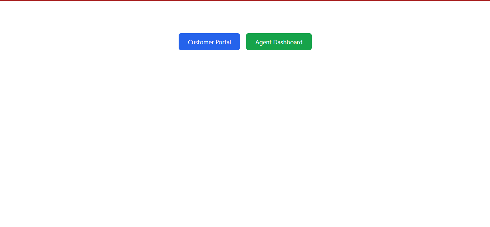
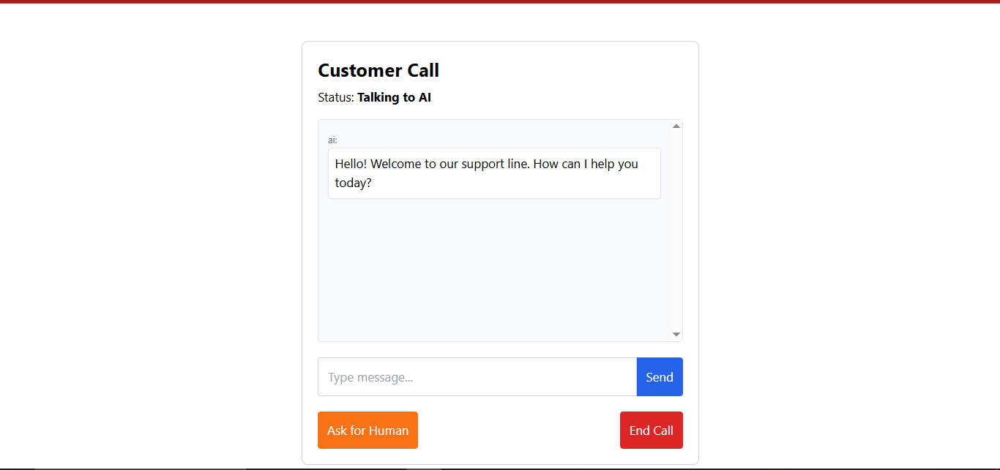
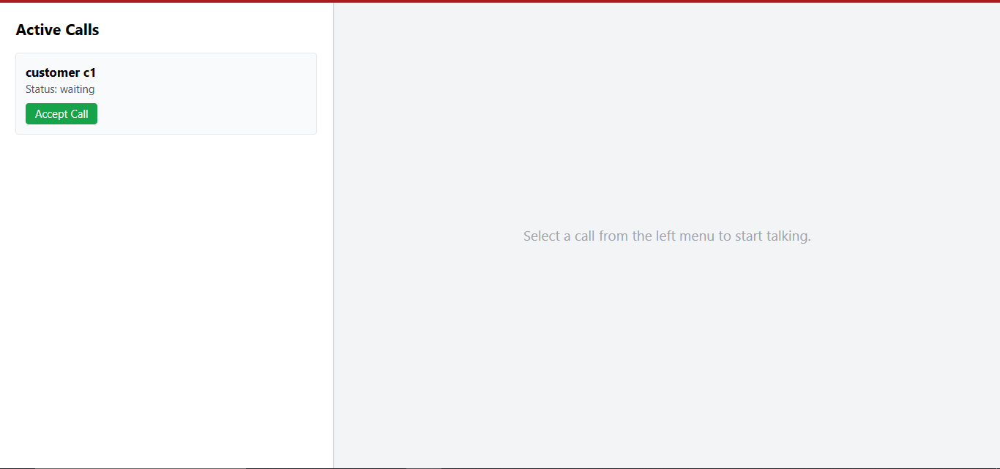

## Architecture Overview

### Backend (Node.js + Express + Socket.io)

```
server/
├── src/
│   ├── server.js                 
│   ├── store.js                 
│   ├── controllers/
│   │   ├── callController.js     
│   │   └── transcriptController.js 
│   ├── routes/
│   │   ├── callRoutes.js   
│   │   ├── transcriptRoutes.js
│   │   └── recordingRoutes.js    
│   ├── socket/
│   │   └── socketHandler.js      
│   └── utils/
│       ├── aiAgent.js            
│       ├── asyncHandler.js       
│       └── ApiError.js          
├── transcripts/                  
└── recordings/                  
```

### Frontend (React + Tailwind CSS 3)

```
frontend/
├── src/
│   ├── App.js                   
│   ├── pages/
│   │   ├── Home.js                     
│   │   ├── CustomerCall.js       
│   │   └── AgentDashboard.js    
│   └── components/
│       ├── Transcript.js        
│       └── CallStatus.js        
```

### Design Decisions

- **In-memory store (Map)** for active rooms 
- **Local JSON files** for transcript persistence 
- **Multer** for audio file uploads, stored as .webm files locally.
- **Socket.io** for signaling and real-time events 
- **WebRTC** for peer-to-peer audio 
- **Web Speech API** for optional speech-to-text
- **Mock AI** uses simple keyword matching to simulate an AI agent (no external API).

## Setup and Running

### Prerequisites

- Node.js (v18+)
- npm

### 1. Clone and install

```bash

cd server
npm install

cd ../frontend
npm install
```

### 2. Environment Setup

Copy `.env.example` from root and create:

**server/.env**
```
PORT=5000
CLIENT_URL=http://localhost:3000
```

**frontend/.env**
```
REACT_APP_SERVER_URL=http://localhost:5000
```

### 3. Run the app

Open two terminals:

```bash

cd server
npm run dev


cd frontend
npm start
```

Server runs on `http://localhost:5000`
Frontend runs on `http://localhost:3000`

### 4. Testing the flow

1. Open `http://localhost:3000` in browser
2. Click **Customer Portal** → enter name → click **Start Call**
3. Type messages to chat with the AI agent
4. Open another tab → go to `http://localhost:3000/agent`
5. Login as agent → you'll see active calls with live transcripts
6. On customer side, click **Request Human Agent**
7. Agent dashboard shows transfer request → click **Accept**
8. WebRTC audio connects, both can now talk and type messages
9. Click **End Call** from either side to finish

## API Endpoints

| Method | Route | Description |
|--------|-------|-------------|
| GET | `/api/calls` | List active calls |
| GET | `/api/calls/:roomId` | Get specific call info |
| GET | `/api/transcripts` | List saved transcripts |
| GET | `/api/transcripts/:roomId` | Get specific transcript |
| POST | `/api/recordings/upload` | Upload audio recording |
| GET | `/api/recordings` | List saved recordings |

All API responses follow format: `{ success: boolean, message: string, data: any }`

## Socket Events

### Client → Server
- `start-call` - Customer starts a call
- `customer-message` - Customer sends message
- `agent-message` - Agent sends message
- `request-transfer` - Customer requests human agent
- `accept-transfer` - Agent accepts transfer
- `end-call` - Either party ends call
- `offer` / `answer` / `ice-candidate` - WebRTC signaling
- `rejoin` - Reconnection attempt

### Server → Client
- `call-started` - Call room created
- `transcript-update` - New message in transcript
- `active-calls-updated` - Call list updated (broadcast)
- `transfer-requested` - Transfer notification
- `agent-joined` - Agent accepted call
- `call-ended` - Call terminated
- `call-transcript` - Full transcript sent on join
- `transfer-failed` - Transfer couldn't complete
- `offer` / `answer` / `ice-candidate` - WebRTC signaling

## Known Limitations

- **No authentication** 
- **No persistent database** 
- **Mock AI** 
- **No room capacity limits** 
- **Speech recognition** 
- **Recording** 


## Output Screen Shot:






